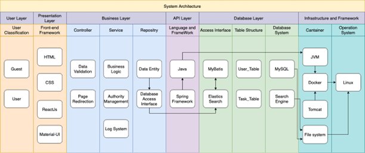

# Task Hero

Task Hero is a team management tool designed to streamline resource allocation for projects within teams. This efficient solution empowers team managers to assign tasks to members, taking into account their individual workloads, while also enabling them to monitor the project's progress. Notably, Task Hero boasts a unique recommending feature, which suggests the best team member pairings for collaborative work, enhancing overall productivity and synergy among team members.

## Table of Contents

- [Contributors](#contributors)
- [Live Demo](#Live-Demo)
- [Features](#features)
- [Local Deployment](#local-deployment)
- [Backend](#backend)
- [System Architecture](#system-architecture)
- [File Structure](#file-structure)
- [Technical Support or Questions](#technical-support-or-questions)

## Contributors

The frontend of Task Hero is developed by

1. Joseph Zhou
2. Yue Wu

## Live Demo

## Features

1. User can sign up with their name, email and password.
2. User can maintain a profile with their basic information (mobile number, email, bio, specialisation, etc.).
3. User can find other users by searching their name, email or id and establish connection with them through their profiles.
4. User can view assigned tasks of the connected users they have in common on their profile pages.
5. Users can efficiently manage both their personal tasks and the tasks they have assigned to others on the Dashboard.
6. Users have the ability to create tasks by providing specific details, including the task label, assignee, priority level, stsart date, end date, wordload and included items. Once the task is created, they can then wait for others to accept the task.
7. Tasks have 4 different statuses, "Not Started", "In Progress", "Blocked" and "Completed".
8. For every task, it has a log books to automatically record modification that has been made.
9. Assigner can give feedback to assignee once they have completed the task.
10. Over time, the number of tasks existing in the system will build up, so the users can search, through all tasks assigned to themselves or any other users they are connected to, by any combination of id, name, description and/or deadline, and view the full details.
11. Users can view the current workload of their connected colleagues. This workload is estimated by the system based on a combination of assigned tasks, task states, task deadlines, and individual task workloads.
12. Over time, the system can continuously recommend potential cooperative partners for users to work with, based on the tasks they have taken to complete in the past.

## Local Deployment
[Please view this local deployment instruction.](ready-to-deploy/instruction.md)
## Backend

## System Architecture


## File Structure

```
.
└── .
    ├── LICENSE.md
    ├── README.md
    ├── jsconfig.json
    ├── package.json
    ├── public
    └── src
        ├── App.js
        ├── api
        ├── assets
        ├── components
        ├── context
        ├── examples
        ├── formikComponents
        ├── index.js
        ├── layouts
        ├── pages
        │   ├── advancedSearch
        │   │   ├── data
        │   │   │   ├── taskData.js
        │   │   │   └── userData.js
        │   │   └── index.js
        │   ├── authentication
        │   │   ├── components
        │   │   │   ├── BasicLayout
        │   │   │   │   └── index.js
        │   │   │   ├── CoverLayout
        │   │   │   │   └── index.js
        │   │   │   └── Footer
        │   │   │       └── index.js
        │   │   ├── reset-password
        │   │   │   └── cover
        │   │   │       └── index.js
        │   │   ├── sign-in
        │   │   │   └── index.js
        │   │   └── sign-up
        │   │       └── index.js
        │   ├── connections
        │   │   ├── data
        │   │   │   ├── connectedTableData.js
        │   │   │   ├── requestTableData.js
        │   │   │   └── sentTableData.js
        │   │   └── index.js
        │   ├── dashboard
        │   │   ├── components
        │   │   │   ├── CreateTasks
        │   │   │   │   └── index.js
        │   │   │   ├── EditTask
        │   │   │   │   └── index.js
        │   │   │   ├── Review
        │   │   │   │   └── index.js
        │   │   │   └── TaskDetails
        │   │   │       └── index.js
        │   │   ├── data
        │   │   │   └── taskData.js
        │   │   └── index.js
        │   ├── editProfile
        │   │   └── index.js
        │   ├── landingPage
        │   │   ├── index.js
        │   │   └── sections
        │   │       ├── Featuring.js
        │   │       ├── Information.js
        │   │       ├── NavbarList.js
        │   │       └── Team.js
        │   ├── profile
        │   │   └── index.js
        │   ├── recommendation
        │   │   ├── data
        │   │   │   └── userData.js
        │   │   └── index.js
        │   ├── search
        │   │   ├── data
        │   │   │   └── taskData.js
        │   │   └── index.js
        │   └── signout
        │       └── index.js
        ├── routes.js
        └── utilities
```

## References

The frontend of this project is built on top of free UI kit [Material Dashboard 2 React](https://github.com/creativetimofficial/material-dashboard-react).

Accessed Date: 10 Sep 2022.

## Technical Support or Questions

If you have questions or need help running the app please contact [Joseph Zhou](josephchow.message@gmail.com).
